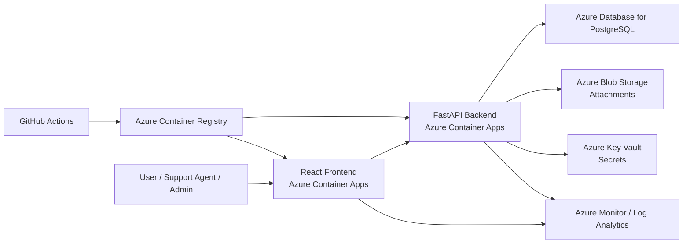

# Mini Helpdesk Platform on Azure

## Project Scope

### Title
**Mini Helpdesk Platform for Managing Support Tickets on Azure**

### Short Description
We will build an open-source mini helpdesk platform that allows users to create, track, and manage support tickets online. The application will be deployed on Microsoft Azure using a PaaS architecture with managed services for compute, database, storage, and monitoring. The solution will be delivered as an all-in-one cloud platform including the frontend, backend API, database, attachment storage, and deployment pipeline.

### Objective
Create a small but complete support system where users can submit issues and support agents can manage them efficiently.

### Roles
- `User`: creates tickets, views own tickets, adds comments
- `Support Agent`: views assigned tickets, updates status and priority, adds comments
- `Admin`: manages users, sees all tickets, views statistics

### Admin Account Setup
- public registration creates normal `user` accounts only
- the first `admin` account is created manually with a seed script
- admins can later promote users to `agent` or `admin` from the dashboard

### MVP Features
- user authentication
- create a ticket
- list tickets
- view ticket details
- update ticket status
- update ticket priority
- add comments
- upload attachments
- admin dashboard with simple statistics

### Out of Scope for MVP
- live chat
- email notifications
- multi-organization support
- advanced analytics
- mobile app

## Recommended Stack

- `Frontend`: React
- `Backend`: FastAPI
- `Database`: PostgreSQL
- `Local development`: Docker Compose
- `Cloud model`: Azure PaaS

## Architecture

### Azure Services
- `Azure Container Apps`: host frontend and backend
- `Azure Database for PostgreSQL Flexible Server`: relational database
- `Azure Blob Storage`: ticket attachments
- `Azure Key Vault`: secrets
- `Azure Container Registry`: Docker images
- `Azure Monitor / Log Analytics`: logs and monitoring



### Request Flow
1. The user opens the frontend.
2. The frontend sends requests to the backend API.
3. The backend stores ticket data in PostgreSQL.
4. Attachments are uploaded to Blob Storage.
5. Secrets such as database connection strings are stored in Key Vault.
6. Logs and metrics are collected in Azure Monitor.
7. GitHub Actions builds and deploys containers to Azure.

## Database Schema

PostgreSQL will use UUID primary keys.

### `users`
```sql
CREATE TABLE users (
    id UUID PRIMARY KEY,
    full_name VARCHAR(100) NOT NULL,
    email VARCHAR(150) NOT NULL UNIQUE,
    password_hash TEXT NOT NULL,
    role VARCHAR(20) NOT NULL CHECK (role IN ('user', 'agent', 'admin')),
    created_at TIMESTAMP NOT NULL DEFAULT CURRENT_TIMESTAMP
);
```

### `tickets`
```sql
CREATE TABLE tickets (
    id UUID PRIMARY KEY,
    title VARCHAR(200) NOT NULL,
    description TEXT NOT NULL,
    status VARCHAR(30) NOT NULL DEFAULT 'open'
        CHECK (status IN ('open', 'in_progress', 'resolved', 'closed')),
    priority VARCHAR(20) NOT NULL DEFAULT 'medium'
        CHECK (priority IN ('low', 'medium', 'high')),
    created_by UUID NOT NULL REFERENCES users(id) ON DELETE CASCADE,
    assigned_to UUID REFERENCES users(id) ON DELETE SET NULL,
    created_at TIMESTAMP NOT NULL DEFAULT CURRENT_TIMESTAMP,
    updated_at TIMESTAMP NOT NULL DEFAULT CURRENT_TIMESTAMP
);
```

### `comments`
```sql
CREATE TABLE comments (
    id UUID PRIMARY KEY,
    ticket_id UUID NOT NULL REFERENCES tickets(id) ON DELETE CASCADE,
    user_id UUID NOT NULL REFERENCES users(id) ON DELETE CASCADE,
    content TEXT NOT NULL,
    created_at TIMESTAMP NOT NULL DEFAULT CURRENT_TIMESTAMP
);
```

### `attachments`
```sql
CREATE TABLE attachments (
    id UUID PRIMARY KEY,
    ticket_id UUID NOT NULL REFERENCES tickets(id) ON DELETE CASCADE,
    uploaded_by UUID NOT NULL REFERENCES users(id) ON DELETE CASCADE,
    file_name VARCHAR(255) NOT NULL,
    blob_url TEXT NOT NULL,
    mime_type VARCHAR(100),
    file_size INTEGER,
    created_at TIMESTAMP NOT NULL DEFAULT CURRENT_TIMESTAMP
);
```

### Relationships
- one `user` can create many `tickets`
- one `agent` can be assigned many `tickets`
- one `ticket` can have many `comments`
- one `ticket` can have many `attachments`

### Simple Schema View
```text
users
  id PK
  role: user | agent | admin

tickets
  id PK
  created_by FK -> users.id
  assigned_to FK -> users.id

comments
  id PK
  ticket_id FK -> tickets.id
  user_id FK -> users.id

attachments
  id PK
  ticket_id FK -> tickets.id
  uploaded_by FK -> users.id
```

## Next Steps

### Phase 1: Project Setup
1. Create the project structure:
   - `frontend/`
   - `backend/`
   - `docs/` if needed later
2. Initialize the frontend with React.
3. Initialize the backend with FastAPI.
4. Add a local PostgreSQL service with Docker Compose.
5. Add environment files for local configuration.

### Phase 2: Backend Development
1. Configure the FastAPI project.
2. Connect the backend to PostgreSQL.
3. Create the `users`, `tickets`, `comments`, and `attachments` tables.
4. Implement authentication.
5. Implement ticket CRUD endpoints.
6. Implement comment endpoints.
7. Implement attachment metadata handling.
8. Add filtering by ticket status and priority.
9. Add a basic admin statistics endpoint.

### Phase 3: Frontend Development
1. Build the login page.
2. Build the ticket list page.
3. Build the ticket details page.
4. Build the create ticket form.
5. Build ticket filters.
6. Build the comment section.
7. Build the admin dashboard.

### Phase 4: Local Integration
1. Connect the React frontend to the FastAPI backend.
2. Test login, ticket creation, status updates, comments, and local file attachments.
3. Verify database persistence.
4. Clean up validation and error messages.

### Phase 5: Containerization
1. Add a `Dockerfile` for the frontend.
2. Add a `Dockerfile` for the backend.
3. Add a `docker-compose.yml` for local full-stack execution.
4. Verify the app runs correctly in containers.

### Phase 6: Azure Deployment
1. Create an Azure Resource Group.
2. Create Azure Container Registry.
3. Create Azure Container Apps for frontend and backend.
4. Create Azure Database for PostgreSQL Flexible Server.
5. Create Blob Storage for attachments.
6. Create Key Vault for secrets.
7. Create Log Analytics and Azure Monitor.
8. Deploy the app and connect all services.

### Phase 7: CI/CD and Finalization
1. Add GitHub Actions for build and deployment.
2. Push container images to Azure Container Registry.
3. Automate deployment to Azure Container Apps.
4. Add monitoring and at least one alert.
5. Prepare screenshots and demo accounts.
6. Finalize README and presentation.

## Immediate Action Items

These are the best next tasks to start with:

1. Create the `backend` project and set up the database connection.
2. Create the `users` table and authentication flow.
3. Implement ticket creation and listing.
4. Create the `frontend` project with the first pages:
   - login
   - ticket list
   - ticket details
5. Add Docker Compose for local development.

## Local Admin Bootstrap

Create or promote an admin account with:

```powershell
docker compose exec backend python scripts/seed_admin.py --email your-admin@example.com --password YourStrongPassword123 --full-name "Your Name"
```

If you are not using Docker and you run the backend from Python directly, use:

```powershell
python backend/scripts/seed_admin.py --email your-admin@example.com --password YourStrongPassword123 --full-name "Your Name"
```

## Database Inspection

If you already have PostgreSQL installed locally, the Docker helpdesk database is exposed on host port `5433` to avoid conflicts with your local PostgreSQL server on `5432`.

Use these pgAdmin connection settings for the app database:

- host: `localhost`
- port: `5433`
- maintenance database: `helpdesk`
- username: `helpdesk`
- password: `helpdesk`

## Local Attachment Storage

- During local development, attachments are uploaded from the ticket details page and stored in the backend container's `uploads/` directory.
- The backend serves those files at `/uploads/...`.
- For the Azure deployment phase, this local storage flow can be replaced with Azure Blob Storage while keeping the attachment records in PostgreSQL.

## Notes

- This project is a **PaaS-based cloud solution** because it uses managed Azure services for the application runtime, database, storage, and monitoring.
- The stack is based on open-source technologies: React, FastAPI, PostgreSQL, Docker, and GitHub Actions.
- Azure deployment should happen after the local MVP is working, especially if subscription credits are limited.
