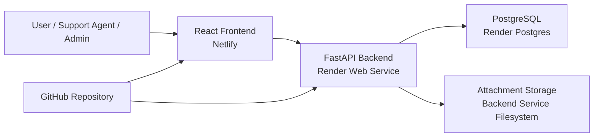

# Mini Helpdesk Platform

## Project Overview

### Title
**Mini Helpdesk Platform for Managing Support Tickets**

### Short Description
This project is an open-source cloud helpdesk platform that allows users to create, track, and manage support tickets online. It is built with React, FastAPI, PostgreSQL, and Docker, then deployed as a PaaS-based web application using Netlify for the frontend and Render for the backend and database.

### Objective
Create a complete but lightweight support system where users can submit issues, support staff can manage workflows, and admins can supervise the platform.

## Scope

### Roles
- `User`: creates tickets, views ticket details, adds comments, uploads attachments
- `Support Agent`: manages assigned tickets, updates status and priority, adds comments
- `Admin`: manages users, promotes roles, sees all tickets, views platform statistics

### Admin Account Setup
- public registration creates normal `user` accounts only
- the first `admin` account is created manually with a seed script
- admins can later promote users to `agent` or `admin` from the dashboard

### MVP Features
- user authentication
- create a ticket
- list tickets
- view ticket details
- update ticket status
- update ticket priority
- assign tickets to staff
- add comments
- upload attachments
- admin dashboard with simple statistics
- role promotion for users

### Out of Scope for MVP
- live chat
- email notifications
- multi-organization support
- advanced analytics
- mobile app

## Technical Stack

- `Frontend`: React + Vite
- `Backend`: FastAPI
- `Database`: PostgreSQL
- `Authentication`: JWT-based login
- `Local development`: Docker Compose
- `Version control`: GitHub
- `Cloud model`: PaaS

## Final Hosted Architecture

### Deployment Services
- `Frontend hosting`: Netlify
- `Backend hosting`: Render Web Service
- `Database hosting`: Render Postgres
- `Source control`: GitHub



### Request Flow
1. The user opens the frontend hosted on Netlify.
2. The frontend sends API requests to the FastAPI backend hosted on Render.
3. The backend stores users, tickets, comments, and attachment metadata in PostgreSQL.
4. Uploaded attachment files are stored on the backend service for the MVP demo.
5. GitHub is used as the deployment source for both frontend and backend.

## Why This Counts as PaaS

- the application is deployed on managed hosting platforms rather than self-managed virtual machines
- the frontend is hosted on Netlify, which manages the web hosting layer
- the backend is hosted on Render, which manages the application runtime and deployment environment
- the database is hosted on Render Postgres, which manages the PostgreSQL service

So the project is a **cloud PaaS solution** built with an **open-source stack**.

## Database Schema

PostgreSQL uses UUID-style identifiers stored as strings in the application models.

### `users`
```sql
CREATE TABLE users (
    id UUID PRIMARY KEY,
    full_name VARCHAR(100) NOT NULL,
    email VARCHAR(150) NOT NULL UNIQUE,
    password_hash TEXT NOT NULL,
    role VARCHAR(20) NOT NULL CHECK (role IN ('user', 'agent', 'admin')),
    created_at TIMESTAMP NOT NULL DEFAULT CURRENT_TIMESTAMP
);
```

### `tickets`
```sql
CREATE TABLE tickets (
    id UUID PRIMARY KEY,
    title VARCHAR(200) NOT NULL,
    description TEXT NOT NULL,
    status VARCHAR(30) NOT NULL DEFAULT 'open'
        CHECK (status IN ('open', 'in_progress', 'resolved', 'closed')),
    priority VARCHAR(20) NOT NULL DEFAULT 'medium'
        CHECK (priority IN ('low', 'medium', 'high')),
    created_by UUID NOT NULL REFERENCES users(id) ON DELETE CASCADE,
    assigned_to UUID REFERENCES users(id) ON DELETE SET NULL,
    created_at TIMESTAMP NOT NULL DEFAULT CURRENT_TIMESTAMP,
    updated_at TIMESTAMP NOT NULL DEFAULT CURRENT_TIMESTAMP
);
```

### `comments`
```sql
CREATE TABLE comments (
    id UUID PRIMARY KEY,
    ticket_id UUID NOT NULL REFERENCES tickets(id) ON DELETE CASCADE,
    user_id UUID NOT NULL REFERENCES users(id) ON DELETE CASCADE,
    content TEXT NOT NULL,
    created_at TIMESTAMP NOT NULL DEFAULT CURRENT_TIMESTAMP
);
```

### `attachments`
```sql
CREATE TABLE attachments (
    id UUID PRIMARY KEY,
    ticket_id UUID NOT NULL REFERENCES tickets(id) ON DELETE CASCADE,
    uploaded_by UUID NOT NULL REFERENCES users(id) ON DELETE CASCADE,
    file_name VARCHAR(255) NOT NULL,
    blob_url TEXT NOT NULL,
    mime_type VARCHAR(100),
    file_size INTEGER,
    created_at TIMESTAMP NOT NULL DEFAULT CURRENT_TIMESTAMP
);
```

### Relationships
- one `user` can create many `tickets`
- one `agent` can be assigned many `tickets`
- one `ticket` can have many `comments`
- one `ticket` can have many `attachments`

## Current Project Status

### Implemented
- registration and login
- JWT authentication
- role-based access control
- admin bootstrap via seed script
- ticket creation and listing
- ticket detail page
- status and priority updates
- ticket assignment to staff
- comments
- attachment uploads
- admin statistics
- user role promotion
- local Docker environment
- hosted deployment on Netlify and Render

### Deployed Endpoints
- `Frontend`: `https://mini-helpdesk-frontend.netlify.app`
- `Backend`: `https://mini-helpdesk-backend-bpm2.onrender.com/api/v1/health`

## Local Development

Run the full local stack with:

```powershell
docker compose up --build -d
```

Local URLs:
- `Frontend`: `http://localhost:5173`
- `Backend`: `http://localhost:8000`
- `Health`: `http://localhost:8000/api/v1/health`

## Local Admin Bootstrap

Create or promote an admin account locally with:

```powershell
docker compose exec backend python scripts/seed_admin.py --email your-admin@example.com --password YourStrongPassword123 --full-name "Your Name"
```

## Hosted Admin Bootstrap

The hosted environment was initialized by connecting to the Render Postgres database and running:

```powershell
docker compose run --rm --no-deps -e DATABASE_URL="postgresql+psycopg://..." backend python scripts/seed_admin.py --email your-admin@example.com --password YourStrongPassword123 --full-name "Your Name"
```

This creates the first admin account without exposing admin creation in the public UI.

## Database Inspection

For local pgAdmin access, connect to the Docker database with:

- host: `localhost`
- port: `5433`
- maintenance database: `helpdesk`
- username: `helpdesk`
- password: `helpdesk`

## Attachment Storage Note

- In the current MVP, attachment files are stored on the backend service filesystem.
- Attachment metadata is still stored in PostgreSQL.
- For a stronger production design, the next step would be moving files to dedicated object storage while keeping metadata in the database.

## Presentation Notes

### Strong Points to Highlight
- open-source stack
- complete cloud-hosted solution
- PaaS deployment model
- role-based ticket workflow
- admin management
- database-backed persistence
- working hosted demo
- Git-based automatic redeployment

### Limitation to Mention Honestly
- attachment storage is suitable for the MVP demo but should move to dedicated object storage in a production-grade version
